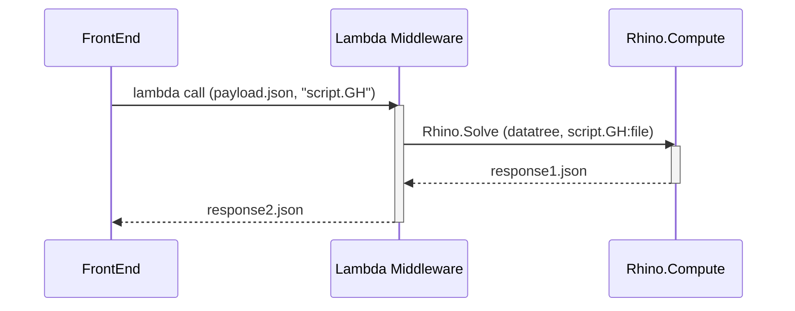

# Skeleton of Sequence diagram

# Intro
A typical software project has at least 2 types of documentation
1. User guide
	- Introduce the user to how to setup and use the project to achieve its purpose
	- TLDR: run this binary with these arguments
2. Developer guide
	- Introduce a new developer to the project and how to get starting making changes 
 
A project which has multiple independent layers needs different more "layers" of documentation, because each layer's user is the layer above it. Eg. Grasshopper layer's user is Middleware. Middleware's user is Frontend.

# Guide for FrontEnd developers

1. Explanation contents of `payload.json`
	1. sample(s) of valid inputs
	2. define valid ranges of arguments
	3. define valid datatypes of arguments
	4. semantic meaning of the input arguments
		- eg. what does this coordinate array represent?
		- eg. what does `float maxElongation` represent in business logic 

2. Explanation of `response2.json`
	1. what fields are returned
	2.  what they represent in business logic
		- eg. coordinate array1 is boundary, coordinate array2 is buildable area
 
# Guide for BackEnd developers
 [Middleware](www.link_to_middleware_docs _ )
- so that backend dev can understand the middleware transformation

 1. Explanation contents of `datatree`
	1. sample(s) of valid inputs
	2. define valid ranges of arguments
	3. define valid datatypes of arguments
	4. semantic meaning of the input arguments
	- The backend might allow for more options than are exposed to FrontEnd dev, how to manage this?
		- eg setback per edge can accept a mapping for custom setback distances, but this is currently not exposed in the external API

2. Explanation of `response2.json`
	1. what fields are returned
	2.  what they represent in business logic
		- eg. coordinate array1 is boundary, coordinate array2 is buildable area
	3. does the middleware transformation do anything to this when turning it into response2.json? 

# Guide for Grasshopper dev

## Developer guide
- how to setup/get started with the project
- dependencies etc
-  https://google.github.io/styleguide/docguide/best_practices.html
-  https://developers.google.com/style
- maybe a readme?

## Code comments
1. ??? IDK if theres a standard for documenting lowcode/nocode 
5. maybe the postit thingies in the `.ghx` file?

